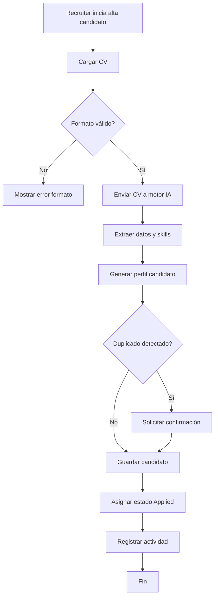
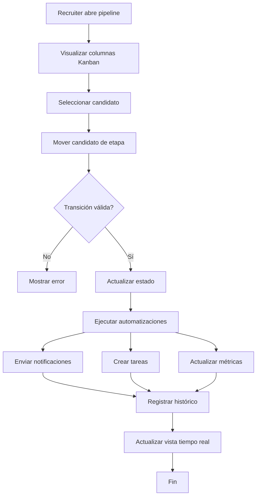
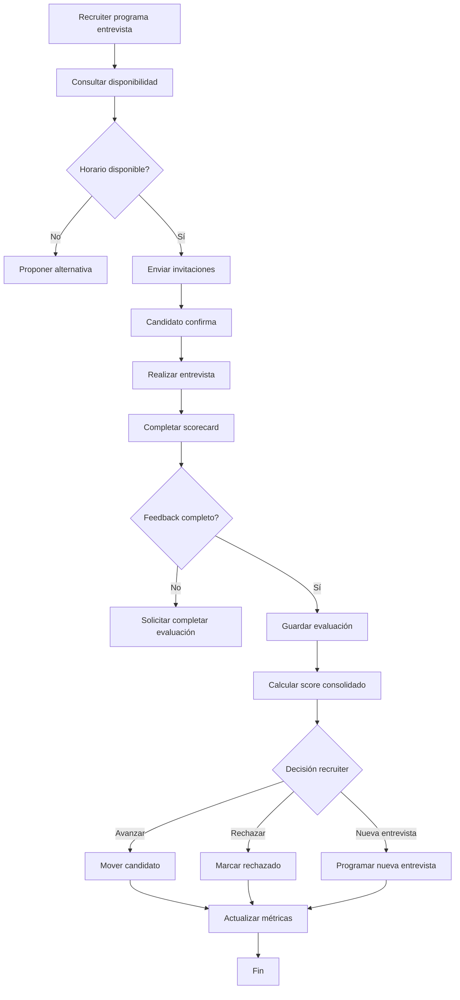

# LTI ATS — Casos de Uso Principales del MVP

> Documento funcional del MVP de LTI ATS  
> Plataforma SaaS moderna de gestión de candidatos y procesos de selección.

---

# Caso de Uso 1 — Gestión y Parsing Inteligente de Candidatos

## 1. Nombre del caso de uso

**Alta y procesamiento inteligente de candidatos**

---

## 2. Objetivo

Permitir a recruiters registrar candidatos rápidamente mediante carga manual o importación de CV, utilizando IA para extraer automáticamente información relevante y acelerar el proceso de screening inicial.

---

## 3. Actor principal

- Recruiter

---

## 4. Actores secundarios

- Sistema LTI ATS
- Servicio IA de Parsing CV
- Base de datos de candidatos
- Hiring Manager

---

## 5. Precondiciones

- El recruiter ha iniciado sesión.
- Existe una vacante activa.
- El recruiter dispone de permisos de edición.
- El CV está disponible en formato compatible.

---

## 6. Flujo principal

1. El recruiter accede a la vacante.
2. Selecciona “Añadir candidato”.
3. El sistema solicita carga de CV.
4. El recruiter adjunta el CV.
5. El sistema valida el archivo.
6. El sistema ejecuta parsing IA.
7. La IA extrae:
   - Datos personales
   - Skills
   - Experiencia
   - Educación
8. El sistema genera automáticamente el perfil.
9. El recruiter revisa información.
10. El recruiter guarda el candidato.
11. El sistema añade el candidato al pipeline.
12. El sistema registra actividad y auditoría.

---

## 7. Flujos alternativos o excepciones

### A1 — CV no soportado

- El sistema rechaza formatos inválidos.
- Se muestra mensaje de error.

### A2 — Error en parsing IA

- El sistema permite completar datos manualmente.
- Se registra incidencia.

### A3 — Candidato duplicado

- El sistema detecta coincidencias.
- Solicita confirmación antes de continuar.

### A4 — Datos incompletos

- El sistema obliga a completar campos mínimos.

---

## 8. Postcondiciones

- El candidato queda registrado.
- El perfil queda asociado a la vacante.
- El pipeline se actualiza automáticamente.
- El histórico queda almacenado.

---

## 9. Reglas de negocio relevantes

- El email debe ser único.
- Solo se aceptan PDF o DOCX.
- Los campos mínimos son:
  - Nombre
  - Apellido
  - Email
- Toda acción debe quedar auditada.
- La IA no puede sobrescribir datos validados manualmente.

---

## 10. Diagrama Mermaid

---

# Caso de Uso 2 — Gestión del Pipeline Kanban de Selección

## 1. Nombre del caso de uso

**Gestión visual del pipeline de selección**

---

## 2. Objetivo

Permitir a recruiters gestionar candidatos mediante un pipeline visual tipo Kanban, facilitando seguimiento, colaboración y automatización del proceso de selección.

---

## 3. Actor principal

- Recruiter

---

## 4. Actores secundarios

- Hiring Manager
- Sistema LTI ATS
- Servicio de notificaciones

---

## 5. Precondiciones

- Existe una vacante activa.
- Existen candidatos registrados.
- El recruiter tiene permisos sobre la vacante.

---

## 6. Flujo principal

1. El recruiter accede al pipeline.
2. El sistema muestra columnas Kanban.
3. El recruiter revisa candidatos.
4. Arrastra un candidato a una nueva etapa.
5. El sistema valida transición.
6. El sistema actualiza estado.
7. El sistema ejecuta automatizaciones:
   - Notificaciones
   - Creación de tareas
   - Recordatorios
8. El sistema actualiza métricas.
9. Hiring Managers visualizan cambios en tiempo real.

---

## 7. Flujos alternativos o excepciones

### A1 — Cambio no permitido

- El sistema bloquea transiciones inválidas.

### A2 — Entrevista pendiente

- El sistema impide mover a “Offer” sin feedback completo.

### A3 — Usuario sin permisos

- El sistema rechaza la acción.

### A4 — Error de sincronización

- El sistema restaura el estado previo.

---

## 8. Postcondiciones

- El estado queda actualizado.
- Se registra historial de cambios.
- Los stakeholders reciben notificaciones.
- Las métricas se recalculan.

---

## 9. Reglas de negocio relevantes

- Solo recruiters asignados pueden modificar pipelines.
- No se puede mover un candidato a “Hired” sin oferta aceptada.
- Toda transición debe registrarse.
- Algunas etapas requieren feedback obligatorio.

---

## 10. Diagrama Mermaid

---

# Caso de Uso 3 — Evaluación Colaborativa y Gestión de Entrevistas

## 1. Nombre del caso de uso

**Planificación y evaluación colaborativa de entrevistas**

---

## 2. Objetivo

Coordinar entrevistas y centralizar evaluaciones estructuradas entre recruiters y hiring managers para mejorar la toma de decisiones de contratación.

---

## 3. Actor principal

- Hiring Manager

---

## 4. Actores secundarios

- Recruiter
- Sistema LTI ATS
- Calendario corporativo
- Servicio de notificaciones

---

## 5. Precondiciones

- El candidato está en fase “Interview”.
- Existe disponibilidad de entrevistadores.
- El usuario tiene permisos adecuados.

---

## 6. Flujo principal

1. El recruiter programa una entrevista.
2. El sistema consulta disponibilidad.
3. El sistema envía invitaciones automáticas.
4. El candidato confirma asistencia.
5. El Hiring Manager realiza entrevista.
6. El sistema muestra scorecard.
7. El Hiring Manager registra:
   - Feedback
   - Rating
   - Comentarios
8. El recruiter revisa evaluaciones.
9. El sistema calcula score consolidado.
10. El recruiter decide:
    - Avanzar
    - Rechazar
    - Nueva entrevista

---

## 7. Flujos alternativos o excepciones

### A1 — Conflicto de calendario

- El sistema propone horarios alternativos.

### A2 — Entrevistador no responde

- El sistema envía recordatorio automático.

### A3 — Feedback incompleto

- El sistema impide cerrar evaluación.

### A4 — Candidato cancela entrevista

- El sistema reprogama automáticamente.

---

## 8. Postcondiciones

- La entrevista queda registrada.
- El feedback queda consolidado.
- El candidato avanza o cambia de estado.
- Las métricas se actualizan.

---

## 9. Reglas de negocio relevantes

- Toda entrevista debe tener evaluador asignado.
- El feedback debe completarse antes de 48 horas.
- Los scorecards son obligatorios.
- Solo usuarios autorizados pueden visualizar evaluaciones.

---

## 10. Diagrama Mermaid

---

# Referencias del Proyecto

Este documento está alineado con:
- Diseño funcional del MVP LTI ATS
- Modelo de datos
- Arquitectura funcional
- Requisitos de automatización e IA
- Pipeline Kanban y workflows ATS modernos
