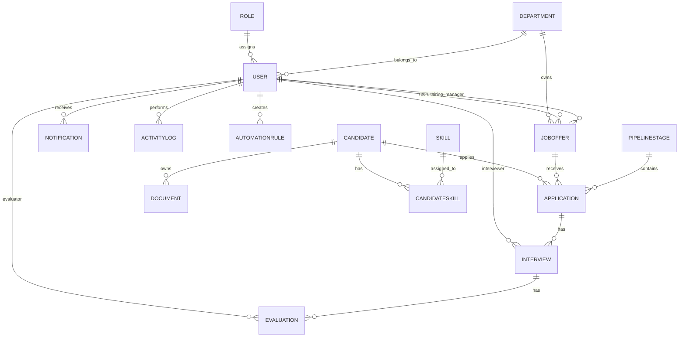

# LTI ATS — Modelo de Datos del MVP

## Autor
Software Architect & Data Modeler

---

# 1. Introducción

Este documento describe el modelo de datos conceptual y lógico del MVP de **LTI ATS**, un Applicant Tracking System moderno orientado a automatizar y optimizar procesos de selección mediante colaboración, workflows e Inteligencia Artificial.

El diseño está alineado con:

- Arquitectura SaaS cloud-native
- API-first
- Escalabilidad futura
- Integraciones externas
- Seguridad y auditoría
- Multiusuario con roles y permisos

---

# 2. Entidades principales

## Entidades core del sistema

- User
- Role
- Department
- Candidate
- JobOffer
- Application
- PipelineStage
- Interview
- Evaluation
- Skill
- CandidateSkill
- Document
- Notification
- ActivityLog
- AutomationRule

---

# 3. Modelo lógico de datos

# User

| Atributo | Tipo | Obligatorio | Descripción |
|---|---|---|---|
| id | UUID PK | Sí | Identificador del usuario |
| firstName | String | Sí | Nombre |
| lastName | String | Sí | Apellido |
| email | String Unique | Sí | Email corporativo |
| passwordHash | String | Sí | Contraseña cifrada |
| status | Enum | Sí | Active, Inactive, Invited |
| roleId | UUID FK | Sí | Rol asociado |
| departmentId | UUID FK | No | Departamento |
| createdAt | DateTime | Sí | Fecha creación |
| updatedAt | DateTime | Sí | Última actualización |

---

# Role

| Atributo | Tipo | Obligatorio | Descripción |
|---|---|---|---|
| id | UUID PK | Sí | Identificador |
| name | String | Sí | Nombre del rol |
| description | String | No | Descripción |
| permissions | JSON | Sí | Lista de permisos |
| createdAt | DateTime | Sí | Fecha creación |

---

# Department

| Atributo | Tipo | Obligatorio | Descripción |
|---|---|---|---|
| id | UUID PK | Sí | Identificador |
| name | String | Sí | Nombre |
| description | String | No | Descripción |
| createdAt | DateTime | Sí | Fecha creación |

---

# Candidate

| Atributo | Tipo | Obligatorio | Descripción |
|---|---|---|---|
| id | UUID PK | Sí | Identificador |
| firstName | String | Sí | Nombre |
| lastName | String | Sí | Apellido |
| email | String Unique | Sí | Email único |
| phone | String | No | Teléfono |
| location | String | No | Ubicación |
| linkedinUrl | String | No | Perfil LinkedIn |
| summary | Text | No | Resumen profesional |
| source | Enum | No | Fuente del candidato |
| aiParsed | Boolean | Sí | Procesado por IA |
| createdAt | DateTime | Sí | Fecha alta |
| updatedAt | DateTime | Sí | Última actualización |

---

# JobOffer

| Atributo | Tipo | Obligatorio | Descripción |
|---|---|---|---|
| id | UUID PK | Sí | Identificador |
| title | String | Sí | Título oferta |
| description | Text | Sí | Descripción |
| departmentId | UUID FK | No | Departamento |
| location | String | No | Ubicación |
| employmentType | Enum | Sí | Tipo contrato |
| seniority | Enum | No | Nivel seniority |
| status | Enum | Sí | Estado |
| recruiterId | UUID FK | Sí | Recruiter |
| hiringManagerId | UUID FK | No | Hiring Manager |
| createdAt | DateTime | Sí | Fecha creación |
| updatedAt | DateTime | Sí | Última actualización |

---

# Application

| Atributo | Tipo | Obligatorio | Descripción |
|---|---|---|---|
| id | UUID PK | Sí | Identificador |
| candidateId | UUID FK | Sí | Candidato |
| jobOfferId | UUID FK | Sí | Oferta |
| pipelineStageId | UUID FK | Sí | Etapa pipeline |
| status | Enum | Sí | Estado candidatura |
| appliedAt | DateTime | Sí | Fecha aplicación |
| rejectionReason | String | No | Motivo rechazo |
| finalScore | Decimal | No | Score final |
| createdAt | DateTime | Sí | Fecha creación |
| updatedAt | DateTime | Sí | Última actualización |

### Restricción

```sql
UNIQUE(candidateId, jobOfferId)
```

---

# PipelineStage

| Atributo | Tipo | Obligatorio | Descripción |
|---|---|---|---|
| id | UUID PK | Sí | Identificador |
| name | String | Sí | Nombre etapa |
| order | Integer | Sí | Orden Kanban |
| isFinal | Boolean | Sí | Etapa final |
| jobOfferId | UUID FK | No | Oferta asociada |
| createdAt | DateTime | Sí | Fecha creación |

---

# Interview

| Atributo | Tipo | Obligatorio | Descripción |
|---|---|---|---|
| id | UUID PK | Sí | Identificador |
| applicationId | UUID FK | Sí | Candidatura |
| interviewerId | UUID FK | Sí | Entrevistador |
| scheduledAt | DateTime | Sí | Fecha entrevista |
| durationMinutes | Integer | Sí | Duración |
| type | Enum | Sí | Tipo entrevista |
| status | Enum | Sí | Estado |
| meetingUrl | String | No | Link reunión |
| createdAt | DateTime | Sí | Fecha creación |

---

# Evaluation

| Atributo | Tipo | Obligatorio | Descripción |
|---|---|---|---|
| id | UUID PK | Sí | Identificador |
| interviewId | UUID FK | Sí | Entrevista |
| evaluatorId | UUID FK | Sí | Evaluador |
| rating | Integer | Sí | Puntuación |
| recommendation | Enum | Sí | Recomendación |
| feedback | Text | Sí | Comentarios |
| scorecard | JSON | No | Evaluación estructurada |
| createdAt | DateTime | Sí | Fecha creación |

---

# Skill

| Atributo | Tipo | Obligatorio | Descripción |
|---|---|---|---|
| id | UUID PK | Sí | Identificador |
| name | String Unique | Sí | Nombre skill |
| category | String | No | Categoría |
| createdAt | DateTime | Sí | Fecha creación |

---

# CandidateSkill

| Atributo | Tipo | Obligatorio | Descripción |
|---|---|---|---|
| candidateId | UUID FK | Sí | Candidato |
| skillId | UUID FK | Sí | Skill |
| level | Enum | No | Nivel |
| source | Enum | No | Origen |
| confidenceScore | Decimal | No | Confianza IA |
| createdAt | DateTime | Sí | Fecha creación |

---

# Document

| Atributo | Tipo | Obligatorio | Descripción |
|---|---|---|---|
| id | UUID PK | Sí | Identificador |
| candidateId | UUID FK | Sí | Candidato |
| fileName | String | Sí | Nombre archivo |
| fileType | Enum | Sí | PDF/DOCX |
| fileUrl | String | Sí | URL storage |
| documentType | Enum | Sí | Tipo documento |
| parsedText | Text | No | Texto parseado |
| uploadedBy | UUID FK | Sí | Usuario uploader |
| createdAt | DateTime | Sí | Fecha subida |

---

# Notification

| Atributo | Tipo | Obligatorio | Descripción |
|---|---|---|---|
| id | UUID PK | Sí | Identificador |
| userId | UUID FK | Sí | Usuario destino |
| title | String | Sí | Título |
| message | Text | Sí | Mensaje |
| type | Enum | Sí | Tipo |
| readAt | DateTime | No | Fecha lectura |
| createdAt | DateTime | Sí | Fecha creación |

---

# ActivityLog

| Atributo | Tipo | Obligatorio | Descripción |
|---|---|---|---|
| id | UUID PK | Sí | Identificador |
| userId | UUID FK | No | Usuario |
| entityType | String | Sí | Tipo entidad |
| entityId | UUID | Sí | Entidad afectada |
| action | String | Sí | Acción |
| oldValue | JSON | No | Valor previo |
| newValue | JSON | No | Valor nuevo |
| createdAt | DateTime | Sí | Fecha evento |

---

# AutomationRule

| Atributo | Tipo | Obligatorio | Descripción |
|---|---|---|---|
| id | UUID PK | Sí | Identificador |
| name | String | Sí | Nombre regla |
| triggerEvent | String | Sí | Evento trigger |
| conditions | JSON | No | Condiciones |
| actions | JSON | Sí | Acciones |
| active | Boolean | Sí | Activa |
| createdBy | UUID FK | Sí | Usuario creador |
| createdAt | DateTime | Sí | Fecha creación |

---

# 4. Relaciones principales

## Relaciones 1:N

| Relación | Descripción |
|---|---|
| Role → User | Un rol puede tener muchos usuarios |
| Department → User | Un departamento puede tener muchos usuarios |
| User → JobOffer | Un recruiter puede gestionar muchas ofertas |
| Candidate → Application | Un candidato puede aplicar a varias ofertas |
| JobOffer → Application | Una oferta puede tener muchas candidaturas |
| PipelineStage → Application | Una etapa contiene muchas candidaturas |
| Application → Interview | Una candidatura puede tener varias entrevistas |
| Interview → Evaluation | Una entrevista puede tener varias evaluaciones |
| Candidate → Document | Un candidato puede tener varios documentos |

---

## Relaciones N:M

| Relación | Tabla intermedia |
|---|---|
| Candidate ↔ Skill | CandidateSkill |

---

# 5. Reglas de negocio

1. Un candidato puede aplicar a múltiples ofertas.
2. Una oferta puede tener múltiples candidatos.
3. No puede existir duplicidad de candidatura para la misma oferta.
4. El email del candidato debe ser único.
5. Toda acción relevante debe quedar auditada.
6. Una candidatura pertenece siempre a una etapa.
7. Una evaluación pertenece a una entrevista.
8. Solo usuarios autorizados pueden acceder a evaluaciones.
9. Los documentos permitidos son PDF y DOCX.
10. La IA no debe sobrescribir datos validados manualmente.

---

# 6. Diagrama ER (Mermaid)



---

# 7. Escalabilidad futura

## Multi-tenant

Añadir entidad:

- Tenant

Y añadir `tenantId` a entidades principales.

---

## Integraciones externas

Posibles entidades futuras:

- Integration
- ExternalSystem
- ApiToken
- WebhookEvent

---

## IA avanzada

Posibles módulos IA:

- AIParsingResult
- CandidateScore
- MatchingResult
- AIRecommendation

---

## Analytics avanzados

Separación futura hacia:

- Data Warehouse
- BI Layer
- Event Streaming
- Métricas históricas

---

## Evolución a microservicios

Separación por dominios:

- ATS Core
- Candidate Service
- Interview Service
- Notification Service
- AI Service
- Reporting Service
- Audit Service

---

# 8. Conclusión

El modelo de datos de LTI ATS proporciona una base sólida para un ATS moderno, escalable y preparado para evolución futura hacia arquitecturas empresariales SaaS multi-tenant, automatización avanzada e integración de Inteligencia Artificial.