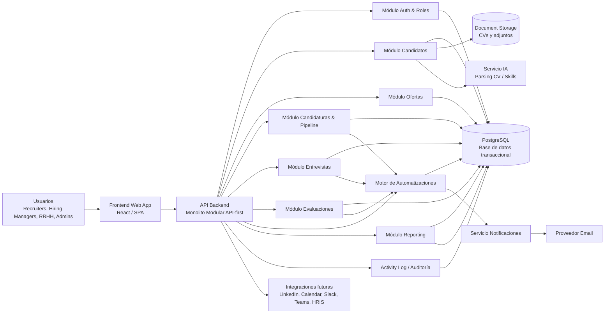
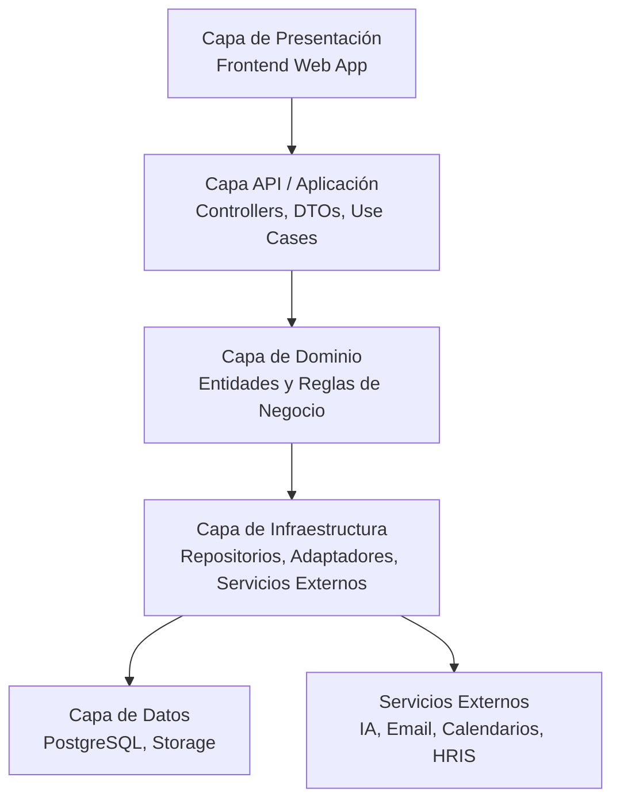
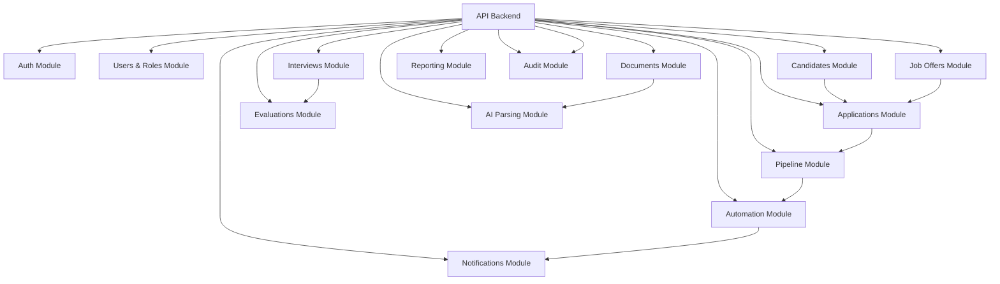
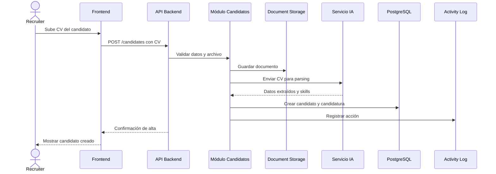
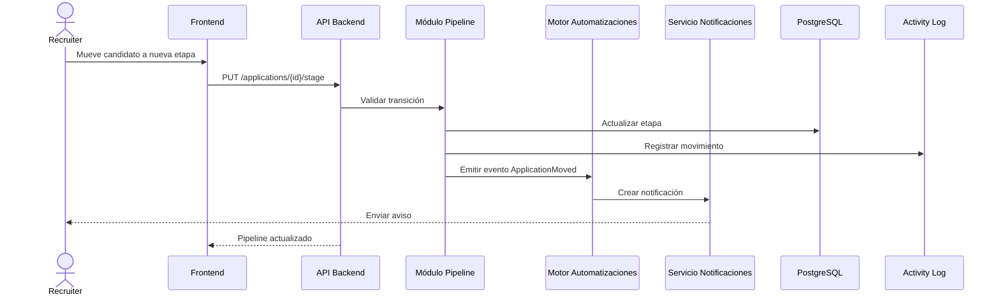
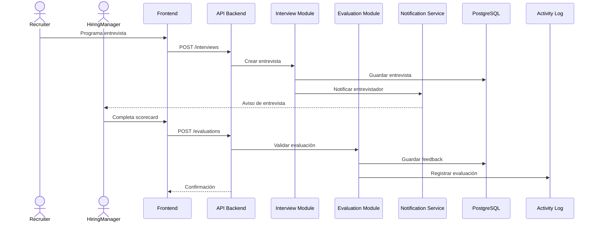
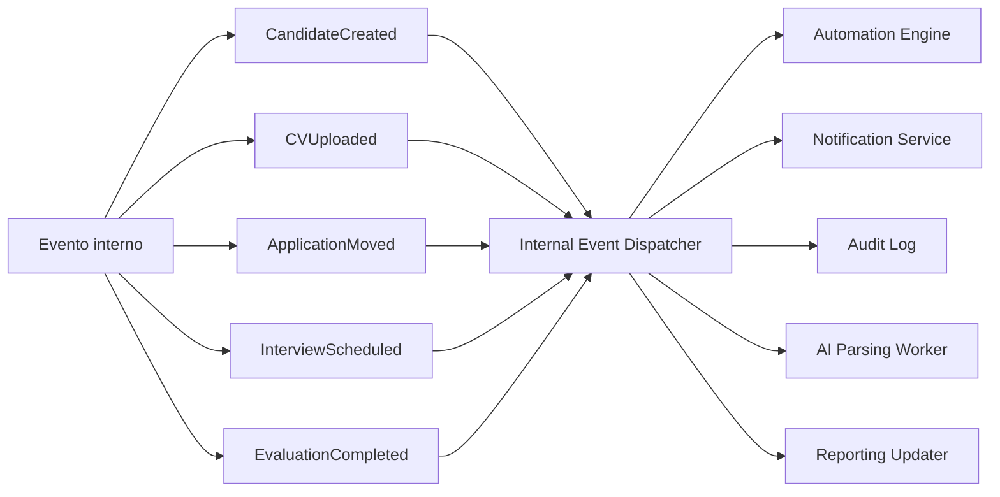
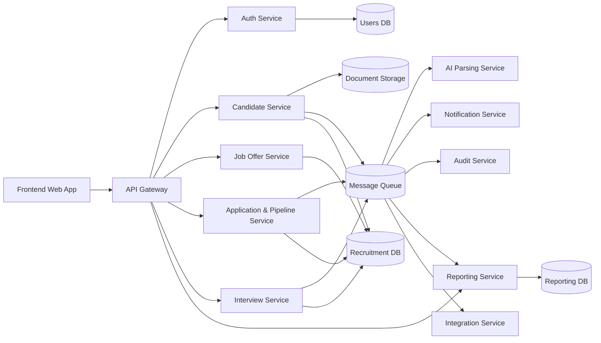

# 🏗 Arquitectura de Alto Nivel — LTI ATS

## 📌 Índice

1. [Introducción](#-introducción)
2. [Contexto del sistema](#-contexto-del-sistema)
3. [Objetivos de la arquitectura](#-objetivos-de-la-arquitectura)
4. [Enfoque arquitectónico recomendado](#-enfoque-arquitectónico-recomendado)
5. [Vista general de la solución](#-vista-general-de-la-solución)
6. [Componentes principales](#-componentes-principales)
7. [Arquitectura por capas](#-arquitectura-por-capas)
8. [Comunicación entre componentes](#-comunicación-entre-componentes)
9. [Seguridad y permisos](#-seguridad-y-permisos)
10. [Gestión de datos y almacenamiento](#-gestión-de-datos-y-almacenamiento)
11. [IA, automatizaciones y procesamiento asíncrono](#-ia-automatizaciones-y-procesamiento-asíncrono)
12. [Reporting y métricas](#-reporting-y-métricas)
13. [Escalabilidad y evolución futura](#-escalabilidad-y-evolución-futura)
14. [Diagramas Mermaid](#-diagramas-mermaid)
15. [Decisiones arquitectónicas clave](#-decisiones-arquitectónicas-clave)
16. [Riesgos y mitigaciones](#-riesgos-y-mitigaciones)
17. [Conclusión](#-conclusión)

---

# 📖 Introducción

**LTI ATS** es una plataforma SaaS moderna para la gestión integral de procesos de selección de personal.

El sistema está orientado a mejorar la eficiencia de recruiters, hiring managers, equipos de RRHH y administradores mediante:

- Gestión centralizada de candidatos.
- Gestión de ofertas de empleo.
- Pipeline visual tipo Kanban.
- Entrevistas y evaluaciones colaborativas.
- Parsing automático de CVs mediante Inteligencia Artificial.
- Automatización de workflows.
- Notificaciones automáticas.
- Reporting y métricas.
- Auditoría e histórico de actividad.

La arquitectura propuesta está diseñada para construir un **MVP sólido, mantenible y escalable**, evitando sobreingeniería en la primera versión, pero dejando una base clara para futuras integraciones y evolución hacia una plataforma SaaS empresarial.

---

# 🧭 Contexto del sistema

## Usuarios principales

| Usuario | Descripción |
|---|---|
| Recruiter | Gestiona candidatos, ofertas, pipelines y comunicación con candidatos. |
| Hiring Manager | Evalúa candidatos, participa en entrevistas y toma decisiones de contratación. |
| Equipo de RRHH | Supervisa procesos, métricas y calidad del proceso de selección. |
| Administrador | Gestiona usuarios, permisos, configuración y seguridad. |

---

## Funcionalidades principales del MVP

El MVP de LTI ATS debe incluir:

- Gestión de usuarios, roles y permisos.
- Gestión de ofertas de empleo.
- Gestión de candidatos.
- Alta de candidatos manual o mediante CV.
- Parsing automático de CVs con IA.
- Gestión de candidaturas.
- Pipeline visual tipo Kanban.
- Gestión de entrevistas.
- Evaluaciones colaborativas.
- Scorecards.
- Notificaciones automáticas.
- Automatización básica de workflows.
- Reporting operativo.
- Auditoría de acciones relevantes.
- Preparación para integraciones externas futuras.

---

# 🎯 Objetivos de la arquitectura

## Objetivos funcionales

- Permitir a recruiters gestionar candidatos y ofertas de forma eficiente.
- Facilitar la colaboración entre recruiters y hiring managers.
- Reducir tareas manuales mediante automatizaciones.
- Mejorar la calidad del screening inicial mediante IA.
- Ofrecer visibilidad del proceso de selección mediante dashboards.
- Mantener trazabilidad completa de las acciones relevantes.

---

## Objetivos técnicos

- Diseñar una arquitectura API-first.
- Mantener una estructura modular.
- Facilitar testing y mantenimiento.
- Evitar acoplamiento excesivo entre módulos.
- Preparar el sistema para escalabilidad futura.
- Permitir evolución progresiva hacia microservicios si el producto crece.
- Garantizar seguridad, control de acceso y protección de datos personales.

---

## Objetivos de negocio

- Lanzar una primera versión viable en menor tiempo.
- Reducir costes iniciales de infraestructura.
- Validar el producto con usuarios reales.
- Permitir evolución iterativa.
- Construir una base técnica preparada para SaaS B2B.

---

# 🧱 Enfoque arquitectónico recomendado

## Recomendación principal

Para el MVP se recomienda una arquitectura basada en:

> **Monolito modular + arquitectura por capas + enfoque hexagonal parcial + event-driven parcial**

---

## ¿Por qué monolito modular?

Un **monolito modular** permite construir el MVP de forma rápida y controlada, separando internamente los dominios funcionales sin asumir desde el inicio la complejidad operativa de los microservicios.

### Ventajas

- Menor complejidad inicial.
- Menor coste de infraestructura.
- Despliegue más sencillo.
- Debugging más fácil.
- Desarrollo más rápido.
- Separación clara por módulos.
- Buena base para evolución futura.

---

## ¿Por qué no microservicios desde el inicio?

Aunque los microservicios pueden ser adecuados en fases avanzadas, para el MVP no son la mejor opción.

### Motivos

- Requieren más madurez DevOps.
- Aumentan la complejidad de despliegue.
- Requieren observabilidad avanzada.
- Introducen problemas de consistencia distribuida.
- Incrementan el coste operativo.
- Pueden ralentizar el desarrollo inicial.

---

## Arquitectura por capas

Se recomienda organizar el backend en capas:

- Capa API / presentación backend.
- Capa de aplicación.
- Capa de dominio.
- Capa de infraestructura.
- Capa de datos.

Esto ayuda a separar responsabilidades y facilita el mantenimiento.

---

## Enfoque hexagonal parcial

No es necesario aplicar arquitectura hexagonal de forma estricta en todo el MVP, pero sí es recomendable usar sus principios en puntos críticos:

- Integración con IA.
- Envío de emails.
- Almacenamiento de documentos.
- Integraciones externas futuras.
- Acceso a base de datos mediante repositorios.

Esto permite sustituir tecnologías externas sin afectar al core del negocio.

---

## Event-driven parcial

El MVP puede incluir eventos internos simples para desacoplar acciones como:

- Enviar notificaciones.
- Ejecutar automatizaciones.
- Registrar auditoría.
- Lanzar parsing IA.
- Recalcular métricas.

No es obligatorio introducir Kafka o RabbitMQ desde el primer día, pero sí diseñar el sistema pensando en eventos.

---

# 🧩 Vista general de la solución

La solución se compone de:

- Una aplicación frontend web.
- Un backend API-first organizado por módulos.
- Una base de datos relacional.
- Un almacenamiento de documentos.
- Un servicio o módulo de IA.
- Un sistema de notificaciones.
- Un motor de automatizaciones.
- Un módulo de reporting.
- Un módulo de auditoría.
- Integraciones externas futuras.

---

# 🧩 Componentes principales

## 🌐 Frontend Web App

Aplicación web utilizada por los usuarios internos del sistema.

### Responsabilidades

- Autenticación de usuarios.
- Navegación principal.
- Dashboard de actividad.
- Gestión de candidatos.
- Gestión de ofertas.
- Pipeline Kanban.
- Gestión de entrevistas.
- Evaluaciones colaborativas.
- Visualización de métricas.
- Administración básica.

### Tecnología recomendada

- React.
- TypeScript.
- Vite.
- TailwindCSS o librería UI equivalente.
- Cliente HTTP para consumir REST API.

---

## ⚙️ API Backend

Componente central del sistema.

### Responsabilidades

- Exponer endpoints REST.
- Orquestar casos de uso.
- Validar reglas de negocio.
- Gestionar autenticación y autorización.
- Coordinar módulos internos.
- Acceder a base de datos.
- Comunicarse con servicios externos.
- Emitir eventos internos.

### Tecnología recomendada

- Node.js.
- TypeScript.
- NestJS o Express.
- ORM como Prisma o TypeORM.

---

## 🔐 Módulo de autenticación y autorización

### Responsabilidades

- Login y logout.
- Gestión de tokens JWT o sesiones seguras.
- Gestión de roles.
- Validación de permisos.
- Protección de endpoints.
- Control de acceso a recursos.

### Roles iniciales

| Rol | Responsabilidad |
|---|---|
| Admin | Configuración global, usuarios y permisos. |
| HR Admin | Supervisión de procesos y reporting. |
| Recruiter | Gestión operativa de candidatos, ofertas y pipeline. |
| Hiring Manager | Evaluación de candidatos y participación en entrevistas. |

---

## 👤 Módulo de candidatos

### Responsabilidades

- Crear candidatos.
- Editar perfiles.
- Buscar y filtrar candidatos.
- Detectar duplicados.
- Asociar documentos.
- Asociar skills.
- Consultar histórico del candidato.
- Gestionar datos extraídos por IA.

### Reglas relevantes

- El email del candidato debe ser único.
- Los CVs deben tener formato permitido.
- La IA puede proponer datos, pero el recruiter debe poder revisarlos.
- No se deben sobrescribir datos confirmados manualmente sin validación.

---

## 💼 Módulo de ofertas

### Responsabilidades

- Crear ofertas.
- Editar ofertas.
- Publicar ofertas.
- Cerrar o archivar ofertas.
- Asignar recruiter responsable.
- Asignar hiring manager.
- Definir requisitos y skills.

### Estados posibles

- Draft.
- Published.
- Closed.
- Archived.

---

## 📌 Módulo de candidaturas y pipeline

### Responsabilidades

- Crear candidaturas.
- Asociar candidato con oferta.
- Gestionar etapa actual.
- Visualizar pipeline Kanban.
- Mover candidatos entre etapas.
- Validar transiciones.
- Registrar histórico de movimientos.
- Lanzar automatizaciones por cambio de estado.

### Etapas iniciales recomendadas

- Applied.
- Screening.
- Interview.
- Technical Test.
- Offer.
- Hired.
- Rejected.

---

## 📅 Módulo de entrevistas

### Responsabilidades

- Programar entrevistas.
- Asignar entrevistadores.
- Definir tipo de entrevista.
- Guardar fecha, hora y duración.
- Gestionar estado de la entrevista.
- Preparar integración futura con calendarios.

### Tipos de entrevista

- HR.
- Technical.
- Culture.
- Final.

---

## 📝 Módulo de evaluaciones

### Responsabilidades

- Registrar feedback estructurado.
- Gestionar scorecards.
- Permitir ratings.
- Consolidar evaluaciones.
- Facilitar decisión colaborativa.
- Controlar permisos sobre feedback.

### Reglas relevantes

- Solo usuarios autorizados pueden evaluar.
- Una entrevista completada debe tener feedback.
- El feedback debe quedar asociado al evaluador.
- Las evaluaciones deben ser auditables.

---

## 🤖 Servicio de parsing IA

### Responsabilidades

- Recibir CVs.
- Extraer texto del documento.
- Identificar datos personales.
- Extraer experiencia profesional.
- Extraer educación.
- Detectar skills.
- Calcular nivel de confianza.
- Proponer resumen del candidato.

### Diseño recomendado

En el MVP puede empezar como módulo interno desacoplado, pero debe diseñarse para poder separarse en el futuro como servicio independiente.

---

## 🔔 Servicio de notificaciones

### Responsabilidades

- Crear notificaciones internas.
- Enviar emails.
- Enviar recordatorios.
- Notificar cambios de pipeline.
- Notificar entrevistas pendientes.
- Preparar integración futura con Slack o Teams.

---

## ⚡ Motor de automatizaciones

### Responsabilidades

- Ejecutar reglas automáticas.
- Reaccionar a eventos internos.
- Crear tareas o recordatorios.
- Enviar notificaciones.
- Ejecutar acciones condicionadas.

### Ejemplos de reglas

| Evento | Acción automática |
|---|---|
| CandidateCreated | Crear candidatura en estado Applied. |
| ApplicationMovedToInterview | Notificar al hiring manager. |
| InterviewScheduled | Enviar recordatorio. |
| EvaluationPending48h | Enviar aviso al evaluador. |
| CandidateRejected | Preparar email de rechazo. |

---

## 📊 Módulo de reporting

### Responsabilidades

- Calcular KPIs.
- Mostrar funnel de selección.
- Medir conversión por etapa.
- Medir Time-to-Hire.
- Mostrar procesos activos.
- Analizar actividad de recruiters.

### KPIs iniciales

- Número de vacantes abiertas.
- Número de candidatos activos.
- Candidatos por etapa.
- Time-to-Hire.
- Conversión por etapa.
- Entrevistas pendientes.
- Evaluaciones pendientes.
- Candidatos rechazados.
- Candidatos contratados.

---

## 🗄 Base de datos transaccional

### Tecnología recomendada

**PostgreSQL**.

### Responsabilidades

- Persistencia estructurada.
- Integridad referencial.
- Consultas transaccionales.
- Restricciones de unicidad.
- Relaciones entre entidades.

### Entidades principales

- User.
- Role.
- Candidate.
- JobOffer.
- Application.
- PipelineStage.
- Interview.
- Evaluation.
- Skill.
- Document.
- Notification.
- ActivityLog.
- AutomationRule.

---

## 📁 Almacenamiento de documentos

### Responsabilidades

- Guardar CVs.
- Guardar documentos adjuntos.
- Controlar acceso a documentos.
- Proteger información personal.
- Permitir escalabilidad de almacenamiento.

### Opciones futuras

- AWS S3.
- Azure Blob Storage.
- Google Cloud Storage.

---

## 📜 Auditoría / Activity Log

### Responsabilidades

- Registrar acciones relevantes.
- Guardar usuario que ejecuta la acción.
- Guardar entidad afectada.
- Guardar valores anteriores y nuevos si aplica.
- Facilitar trazabilidad.
- Dar soporte a cumplimiento GDPR.

### Acciones auditables

- Creación de candidato.
- Modificación de datos personales.
- Subida de CV.
- Movimiento de candidatura.
- Creación de evaluación.
- Rechazo de candidato.
- Contratación.
- Cambios de permisos.

---

## 🔌 Integraciones externas futuras

Integraciones previstas:

- LinkedIn.
- InfoJobs.
- Google Calendar.
- Outlook Calendar.
- Slack.
- Microsoft Teams.
- HRIS.
- ERP.
- Plataformas de assessment.
- Sistemas de nómina.

---

# 🏛 Arquitectura por capas

## Capa de presentación

Incluye:

- Frontend Web App.
- Componentes UI.
- Formularios.
- Dashboards.
- Pipeline Kanban.

Responsabilidad principal:

- Interactuar con el usuario y consumir la API backend.

---

## Capa API / aplicación

Incluye:

- Controllers.
- DTOs.
- Validaciones.
- Casos de uso.
- Servicios de aplicación.

Responsabilidad principal:

- Orquestar operaciones del sistema.

---

## Capa de dominio

Incluye:

- Entidades de negocio.
- Reglas de negocio.
- Servicios de dominio.
- Validaciones del core funcional.

Responsabilidad principal:

- Representar las reglas esenciales del ATS.

---

## Capa de infraestructura

Incluye:

- Repositorios.
- ORM.
- Clientes de servicios externos.
- Adaptadores de IA.
- Adaptadores de email.
- Adaptadores de almacenamiento.

Responsabilidad principal:

- Conectar el dominio con tecnologías externas.

---

## Capa de datos

Incluye:

- PostgreSQL.
- Migraciones.
- Índices.
- Constraints.
- Backups.

Responsabilidad principal:

- Garantizar persistencia, consistencia e integridad de datos.

---

## Servicios externos

Incluye:

- Servicio IA.
- Proveedor de email.
- Calendarios externos.
- Sistemas HRIS.
- Servicios de almacenamiento cloud.

Responsabilidad principal:

- Proporcionar capacidades complementarias al core del ATS.

---

# 🔄 Comunicación entre componentes

## HTTP/REST

La comunicación principal entre frontend y backend será mediante REST API.

Ejemplos:

```http
GET /candidates
POST /candidates
GET /candidates/{id}
PUT /candidates/{id}
GET /job-offers
POST /job-offers
POST /applications
PUT /applications/{id}/stage
POST /interviews
POST /evaluations
GET /reports/pipeline
```

---

## Eventos internos

El backend puede emitir eventos internos para desacoplar procesos.

Ejemplos:

- CandidateCreated.
- CandidateUpdated.
- CVUploaded.
- CVParsed.
- ApplicationCreated.
- ApplicationMoved.
- InterviewScheduled.
- EvaluationCompleted.
- CandidateRejected.
- CandidateHired.

---

## Procesamiento asíncrono

Procesos candidatos a ejecutarse de forma asíncrona:

- Parsing de CVs.
- Envío de emails.
- Notificaciones.
- Automatizaciones.
- Recalculo de métricas.
- Sincronización con integraciones externas.

---

## Jobs programados

Ejemplos:

- Enviar recordatorios de entrevistas.
- Avisar de feedback pendiente.
- Recalcular métricas diarias.
- Archivar procesos antiguos.
- Limpiar logs antiguos según política de retención.

---

## Webhooks futuros

Se podrán utilizar webhooks para:

- Recibir candidaturas desde portales externos.
- Notificar contrataciones a un HRIS.
- Enviar eventos a Slack o Teams.
- Sincronizar calendarios.

---

# 🔐 Seguridad y permisos

## Autenticación

Recomendaciones:

- Login con email y contraseña.
- Hash seguro de contraseñas.
- JWT o sesiones seguras.
- Refresh tokens.
- HTTPS obligatorio.
- Posible SSO/SAML/OAuth2 en versiones futuras.

---

## Autorización

Modelo recomendado:

> **RBAC — Role-Based Access Control**

### Matriz inicial de permisos

| Acción | Admin | HR Admin | Recruiter | Hiring Manager |
|---|---:|---:|---:|---:|
| Gestionar usuarios | Sí | No | No | No |
| Configurar permisos | Sí | No | No | No |
| Crear ofertas | Sí | Sí | Sí | No |
| Editar ofertas asignadas | Sí | Sí | Sí | Parcial |
| Crear candidatos | Sí | Sí | Sí | No |
| Ver candidatos asignados | Sí | Sí | Sí | Sí |
| Mover pipeline | Sí | Sí | Sí | No |
| Programar entrevistas | Sí | Sí | Sí | Parcial |
| Completar evaluaciones | Sí | Sí | Sí | Sí |
| Ver reporting | Sí | Sí | Parcial | Parcial |
| Acceder a auditoría | Sí | Sí | No | No |

---

## Control de acceso a candidatos y ofertas

El sistema debe controlar:

- Qué ofertas puede ver cada usuario.
- Qué candidatos puede consultar cada usuario.
- Qué candidaturas puede modificar.
- Qué evaluaciones puede visualizar.
- Qué documentos puede descargar.

---

## Protección de documentos

Buenas prácticas:

- Almacenamiento cifrado.
- URLs firmadas temporales.
- Control de acceso por rol.
- Registro de descargas.
- Evitar exposición pública de documentos.

---

## Protección de datos personales

El sistema tratará datos personales sensibles para procesos de selección.

Medidas recomendadas:

- Cifrado en tránsito.
- Cifrado en reposo.
- Minimización de datos.
- Control de retención.
- Auditoría de accesos.
- Políticas de borrado.

---

## GDPR

Consideraciones básicas:

- Consentimiento para tratamiento de datos.
- Derecho de acceso.
- Derecho de rectificación.
- Derecho de supresión.
- Derecho al olvido.
- Limitación de conservación de datos.
- Registro de actividades relevantes.
- Control de acceso por necesidad funcional.

---

# 🗃 Gestión de datos y almacenamiento

## Base de datos principal

Se recomienda PostgreSQL para el MVP por ser:

- Relacional.
- Robusta.
- Con soporte para transacciones.
- Adecuada para relaciones complejas.
- Compatible con JSON para campos flexibles.
- Escalable para una primera fase SaaS.

---

## Datos estructurados

Se almacenan en PostgreSQL:

- Usuarios.
- Roles.
- Candidatos.
- Ofertas.
- Candidaturas.
- Entrevistas.
- Evaluaciones.
- Skills.
- Notificaciones.
- Logs.
- Automatizaciones.

---

## Datos no estructurados

Se almacenan en document storage:

- CVs.
- Cartas de presentación.
- Documentos adjuntos.
- Archivos importados.

---

## Índices recomendados

| Tabla | Campo | Motivo |
|---|---|---|
| Candidate | email | Búsqueda y unicidad. |
| Candidate | lastName | Búsqueda. |
| JobOffer | status | Filtrado por estado. |
| Application | candidateId | Relación frecuente. |
| Application | jobOfferId | Pipeline por oferta. |
| Application | pipelineStageId | Agrupación por etapa. |
| Interview | scheduledAt | Consultas por fecha. |
| ActivityLog | entityId | Auditoría por entidad. |
| Notification | userId | Notificaciones por usuario. |

---

# 🤖 IA, automatizaciones y procesamiento asíncrono

## Parsing IA de CV

Flujo recomendado:

1. Recruiter sube CV.
2. Backend valida formato.
3. Documento se guarda en storage.
4. Se genera evento `CVUploaded`.
5. Servicio IA procesa el documento.
6. IA devuelve datos extraídos.
7. Recruiter revisa y confirma.
8. Sistema guarda perfil del candidato.

---

## Matching candidato-oferta

En el MVP puede ser básico:

- Comparación de skills.
- Experiencia relevante.
- Seniority.
- Localización.
- Keywords de la oferta.

En futuras versiones puede evolucionar a matching semántico avanzado.

---

## Automatizaciones MVP

Automatizaciones recomendadas:

- Crear notificación al mover candidato.
- Enviar recordatorio de entrevista.
- Avisar de evaluación pendiente.
- Registrar actividad automáticamente.
- Crear tarea tras cambio de etapa.

---

# 📊 Reporting y métricas

## Reporting operativo MVP

El reporting inicial debe centrarse en visibilidad operativa.

### Métricas recomendadas

| Métrica | Descripción |
|---|---|
| Vacantes abiertas | Número de ofertas activas. |
| Candidatos activos | Candidatos en procesos abiertos. |
| Candidatos por etapa | Distribución en pipeline. |
| Time-to-Hire | Tiempo medio hasta contratación. |
| Conversión por etapa | Porcentaje que avanza entre fases. |
| Entrevistas pendientes | Entrevistas programadas no completadas. |
| Evaluaciones pendientes | Feedback no completado. |
| Rechazos | Candidatos rechazados por periodo. |
| Contrataciones | Candidatos contratados por periodo. |

---

## Evolución futura de reporting

En versiones posteriores:

- Data warehouse.
- Dashboards avanzados.
- Analytics predictivo.
- Benchmarking de fuentes.
- Métricas por recruiter.
- Métricas por departamento.

---

# 🚀 Escalabilidad y evolución futura

## Evolución de monolito modular a microservicios

El sistema puede empezar como monolito modular y evolucionar gradualmente.

Servicios candidatos a separarse:

- Servicio de IA.
- Servicio de notificaciones.
- Servicio de reporting.
- Servicio de integraciones.
- Servicio de auditoría.

---

## Multi-tenant SaaS

Para soportar múltiples empresas, se recomienda incorporar:

- Entidad `Tenant`.
- Campo `tenantId` en entidades principales.
- Aislamiento lógico de datos.
- Configuración por organización.
- Branding por tenant.
- Límites de uso por plan.

Entidades que deberían incluir `tenantId`:

- User.
- Candidate.
- JobOffer.
- Application.
- PipelineStage.
- Interview.
- Evaluation.
- Document.
- Notification.
- ActivityLog.
- AutomationRule.

---

## Colas de mensajes futuras

Se recomienda introducir colas cuando aumente la carga.

Casos de uso:

- Parsing IA asíncrono.
- Envío de emails.
- Procesamiento de automatizaciones.
- Webhooks.
- Reporting batch.

Tecnologías posibles:

- RabbitMQ.
- Kafka.
- AWS SQS.
- Redis Queue.

---

## Separación futura del servicio IA

Motivos para separarlo:

- Requiere escalado independiente.
- Puede consumir muchos recursos.
- Puede tener dependencias específicas.
- Puede usar proveedores externos.
- Puede necesitar colas de procesamiento.

---

## Separación futura de reporting

Motivos:

- Evitar sobrecargar la base transaccional.
- Permitir dashboards complejos.
- Crear histórico analítico.
- Soportar analítica avanzada.

---

# 🧭 Diagramas Mermaid

## Diagrama 1 — Arquitectura general de alto nivel



---

## Diagrama 2 — Arquitectura por capas



---

## Diagrama 3 — Módulos internos del backend



---

## Diagrama 4 — Flujo de alta de candidato con IA



---

## Diagrama 5 — Flujo de movimiento en pipeline



---

## Diagrama 6 — Flujo de entrevista y evaluación



---

## Diagrama 7 — Event-driven parcial



---

## Diagrama 8 — Evolución futura hacia microservicios



---

# 🧠 Decisiones arquitectónicas clave

| Decisión | Opción elegida | Justificación | Alternativa descartada |
|---|---|---|---|
| Arquitectura inicial | Monolito modular | Permite rapidez, menor complejidad y separación interna clara. | Microservicios desde el inicio. |
| Estilo de API | REST API | Simple, estándar y suficiente para el MVP. | GraphQL. |
| Frontend | React SPA | Buena experiencia de usuario y ecosistema maduro. | Aplicación server-rendered tradicional. |
| Backend | Node.js + TypeScript | Productividad, tipado y ecosistema amplio. | Backend sin tipado fuerte. |
| Base de datos | PostgreSQL | Robusta, relacional y adecuada para datos transaccionales. | NoSQL como base principal. |
| ORM | Prisma o TypeORM | Facilita modelado, migraciones y acceso seguro a datos. | SQL manual en todo el sistema. |
| Seguridad | JWT + RBAC | Modelo claro y escalable para permisos. | Permisos hardcoded. |
| IA | Módulo desacoplable | Permite separarlo como servicio futuro. | IA acoplada rígidamente al core. |
| Storage documentos | Almacenamiento externo | Mejor escalabilidad y seguridad para archivos. | Guardar CVs en base de datos. |
| Automatizaciones | Event-driven parcial | Desacopla acciones automáticas sin complejidad excesiva. | Automatizaciones hardcoded. |
| Reporting | Módulo interno inicial | Suficiente para MVP y rápido de implementar. | Data warehouse desde el inicio. |
| Auditoría | Activity Log centralizado | Necesario para trazabilidad y compliance. | No registrar acciones. |
| Multi-tenant | Preparación futura | Permite evolucionar a SaaS multiempresa. | Diseñarlo tarde sin previsión. |
| Integraciones | Adaptadores externos | Reduce acoplamiento con proveedores. | Integraciones directas en lógica de negocio. |

---

# ⚠️ Riesgos y mitigaciones

| Riesgo | Impacto | Mitigación |
|---|---|---|
| Monolito demasiado acoplado | Dificulta evolución futura. | Separar módulos y capas desde el inicio. |
| IA poco precisa | Datos incorrectos de candidatos. | Permitir revisión manual por recruiter. |
| Exposición de datos personales | Riesgo legal y reputacional. | RBAC, cifrado, auditoría y GDPR. |
| Reporting lento | Mala experiencia de usuario. | Índices, consultas optimizadas y futura separación analítica. |
| Automatizaciones complejas | Difícil mantenimiento. | Motor de reglas simple y auditable. |
| Crecimiento multi-tenant no previsto | Reescritura futura costosa. | Preparar entidades para tenantId. |
| Documentos mal protegidos | Fuga de CVs. | Storage privado, URLs firmadas y logs de acceso. |
| Integraciones externas frágiles | Errores operativos. | Uso de adaptadores y webhooks controlados. |

---

# ✅ Conclusión

La arquitectura propuesta para **LTI ATS** es adecuada para un MVP porque combina simplicidad inicial con capacidad de evolución futura.

El enfoque de **monolito modular API-first** permite construir una primera versión robusta sin introducir complejidad innecesaria. Al mismo tiempo, la separación por módulos, capas y eventos internos prepara el sistema para crecer hacia una plataforma SaaS más avanzada.

Esta arquitectura permite cubrir las necesidades principales del producto:

- Gestión de candidatos.
- Gestión de ofertas.
- Pipeline Kanban.
- Entrevistas.
- Evaluaciones colaborativas.
- IA aplicada al parsing de CVs.
- Automatizaciones.
- Reporting.
- Auditoría.
- Seguridad y cumplimiento GDPR.

Además, deja preparada la evolución futura hacia:

- Multi-tenant SaaS.
- Microservicios.
- Colas de mensajes.
- Servicio IA independiente.
- Reporting avanzado.
- Integraciones externas con LinkedIn, calendarios, Slack, Teams y HRIS.

En resumen, se trata de una arquitectura equilibrada, realista y apropiada para lanzar el MVP de LTI ATS con una base técnica profesional y escalable.
