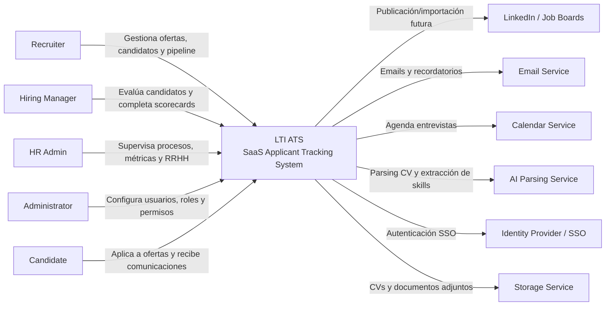
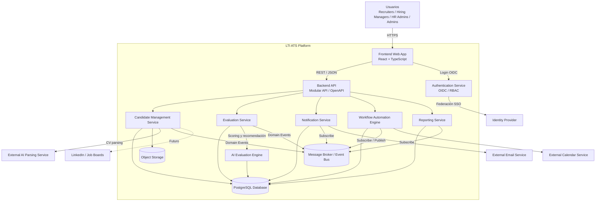
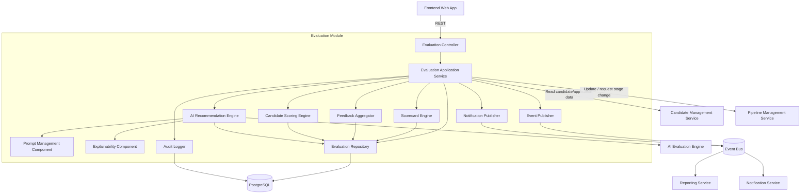
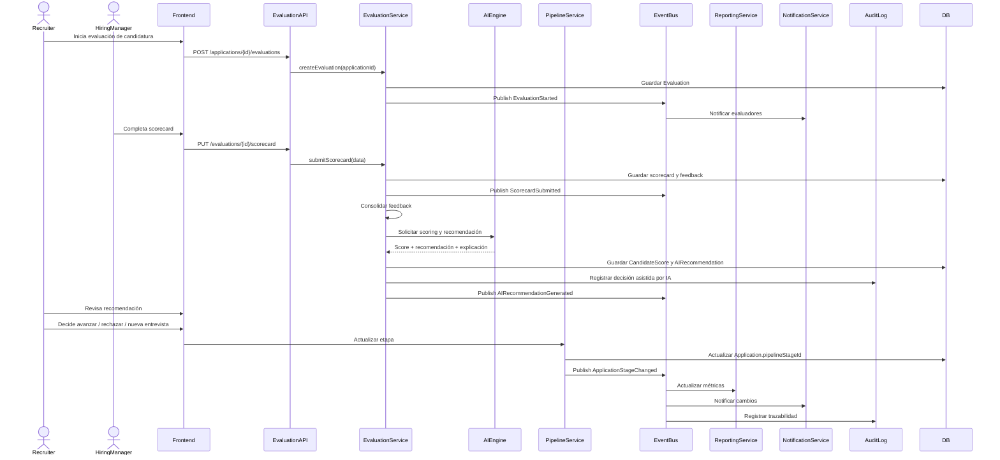

# Arquitectura C4 de LTI ATS

## 1. Introducción

LTI ATS es una plataforma SaaS cloud-native para gestionar procesos de selección de personal, candidatos, ofertas, entrevistas, evaluaciones, automatizaciones, reporting e IA aplicada al reclutamiento.

La arquitectura propuesta se basa en un monolito modular para el MVP, con límites de dominio claros para evolucionar progresivamente hacia microservicios. El sistema se diseña con enfoque API-first, orientación a eventos, seguridad por diseño, observabilidad y preparación futura para multi-tenant.

La solución está alineada con la visión de producto ya definida: centralización del ciclo de reclutamiento, automatización de tareas, IA aplicada, colaboración entre recruiters y hiring managers, trazabilidad y métricas en tiempo real.

---

## 2. Principios arquitectónicos

- **SaaS cloud-native**: preparado para desplegarse en cloud pública y escalar horizontalmente.
- **API-first**: todo dominio funcional expone APIs internas y externas bien definidas.
- **Monolito modular inicial**: menor complejidad operativa para el MVP.
- **Evolución a microservicios**: separación futura por dominios: candidatos, ofertas, evaluaciones, IA, notificaciones y reporting.
- **Event-Driven Architecture**: eventos para cambios de estado, evaluaciones, notificaciones, reporting y auditoría.
- **Clean Architecture**: separación entre capa de presentación, aplicación, dominio e infraestructura.
- **DDD**: módulos alineados con bounded contexts del negocio.
- **Security by Design**: RBAC, auditoría, cifrado, control de acceso y protección de datos personales.
- **Observabilidad**: logs estructurados, métricas, trazas y alertas.
- **Preparación multi-tenant**: tenantId en entidades clave en futuras versiones.

---

## 3. Bounded Contexts principales

| Bounded Context | Responsabilidad principal |
|---|---|
| Identity & Access | Usuarios, roles, permisos, SSO, sesiones |
| Job Management | Gestión de ofertas, departamentos y participantes |
| Candidate Management | Alta, perfil, CV, skills, candidaturas |
| Pipeline Management | Estados Kanban, transiciones, reglas de avance |
| Interview Management | Planificación, calendario, entrevistas |
| Evaluation Management | Scorecards, feedback, scoring, recomendaciones IA |
| AI Services | Parsing CV, matching, recomendaciones, explicabilidad |
| Workflow Automation | Reglas, triggers, automatizaciones |
| Notification Management | Emails, alertas internas, recordatorios |
| Reporting & Analytics | KPIs, métricas, dashboards |
| Audit & Compliance | Histórico, trazabilidad, evidencias |

---

# 4. C4 Nivel 1 — System Context Diagram

## 4.1 Descripción

El sistema LTI ATS centraliza el proceso de selección. Los usuarios internos gestionan ofertas, candidatos, entrevistas y evaluaciones. Los candidatos interactúan principalmente mediante formularios, comunicaciones y futuras integraciones externas.

Sistemas externos relevantes:

- **LinkedIn / Job Boards**: publicación o importación futura de candidatos.
- **Email Service**: envío de comunicaciones y notificaciones.
- **Calendar Service**: planificación de entrevistas.
- **AI Parsing Service**: extracción de datos desde CVs.
- **Identity Provider**: autenticación SSO.
- **Storage Service**: almacenamiento de CVs y documentos.

## 4.2 Mermaid — C4 Nivel 1



---

# 5. C4 Nivel 2 — Container Diagram

## 5.1 Contenedores principales

| Contenedor | Responsabilidad | Tecnología sugerida | Comunicación | Datos gestionados |
|---|---|---|---|---|
| Frontend Web App | UI para recruiters, managers, RRHH y admins | React + TypeScript + Vite | HTTPS / REST / WebSocket | Estado UI, formularios, dashboards |
| Backend API | API principal y orquestación del dominio | Node.js + NestJS / Java Spring Boot | REST / OpenAPI / eventos | Casos de uso transaccionales |
| Authentication Service | Login, SSO, tokens, RBAC | Auth0 / Keycloak / Cognito | OAuth2 / OIDC | Usuarios, sesiones, claims |
| Candidate Management Service | Candidatos, CVs, skills, candidaturas | Módulo backend | REST / eventos | Candidate, Application, Document, Skill |
| Evaluation Service | Scorecards, feedback, scoring consolidado | Módulo backend | REST / eventos | Evaluation, Scorecard, CandidateScore |
| AI Evaluation Engine | Scoring IA, matching y recomendaciones | Python FastAPI / servicio IA | REST / async jobs | Scores, embeddings, recomendaciones |
| Notification Service | Emails, alertas y recordatorios | Módulo backend + proveedor email | Eventos / SMTP API | Notification, templates |
| Workflow Automation Engine | Reglas automáticas por eventos | Módulo backend / Temporal futuro | Eventos | AutomationRule, executions |
| Reporting Service | KPIs, métricas y dashboards | Módulo backend / BI futuro | REST / eventos | HiringMetric, PipelineMetric |
| PostgreSQL Database | Persistencia relacional transaccional | PostgreSQL | SQL | Datos de negocio |
| Object Storage | CVs y documentos | S3 / Azure Blob / GCS | HTTPS SDK | PDFs, DOCX, adjuntos |
| Message Broker / Event Bus | Comunicación asíncrona | RabbitMQ / Kafka / SNS+SQS | Pub/Sub | Eventos de dominio |

## 5.2 Mermaid — C4 Nivel 2



---

# 6. C4 Nivel 3 — Component Diagram: Módulo de evaluación de candidatos con IA

## 6.1 Objetivo del módulo

El módulo de evaluación permite que hiring managers y recruiters registren feedback estructurado, completen scorecards, consoliden valoraciones, calculen un scoring objetivo y reciban recomendaciones asistidas por IA.

La IA no toma decisiones finales. Actúa como soporte a la decisión humana, ofreciendo scoring, explicación y recomendaciones trazables.

## 6.2 Componentes

| Componente | Responsabilidad |
|---|---|
| Evaluation Controller | Expone endpoints REST para iniciar, consultar y completar evaluaciones |
| Evaluation Application Service | Orquesta casos de uso de evaluación |
| Scorecard Engine | Valida y calcula scorecards estructurados |
| Feedback Aggregator | Consolida feedback de varios evaluadores |
| Candidate Scoring Engine | Calcula score final combinando rating, skills, experiencia y feedback |
| AI Recommendation Engine | Genera recomendación asistida por IA |
| Prompt Management Component | Gestiona prompts versionados para IA |
| Explainability Component | Explica por qué se genera una recomendación |
| Audit Logger | Registra acciones y evidencias de evaluación |
| Notification Publisher | Publica eventos para notificar a usuarios |
| Evaluation Repository | Persiste evaluaciones, scorecards y scores |
| Event Publisher | Publica eventos de dominio en el bus |

## 6.3 APIs internas sugeridas

| API | Método | Descripción |
|---|---|---|
| `/applications/{id}/evaluations` | POST | Iniciar evaluación |
| `/evaluations/{id}` | GET | Consultar evaluación |
| `/evaluations/{id}/scorecard` | PUT | Completar scorecard |
| `/applications/{id}/evaluation-summary` | GET | Obtener feedback consolidado |
| `/applications/{id}/ai-recommendation` | POST | Solicitar recomendación IA |
| `/applications/{id}/final-score` | GET | Consultar score final |

## 6.4 Eventos emitidos

| Evento | Cuándo se emite | Consumidores |
|---|---|---|
| `EvaluationStarted` | Se inicia una evaluación | Notification, Audit |
| `ScorecardSubmitted` | Un manager completa scorecard | Reporting, Audit |
| `FeedbackConsolidated` | Se consolida feedback | AI Engine, Reporting |
| `CandidateScored` | Se calcula score final | Pipeline, Reporting |
| `AIRecommendationGenerated` | IA genera recomendación | Notification, Audit |
| `ApplicationStageUpdateRequested` | Se recomienda cambio de etapa | Workflow, Pipeline |

## 6.5 Mermaid — C4 Nivel 3



---

# 7. Flujo completo de evaluación IA

## 7.1 Paso a paso

| Paso | Acción | Input | Output | Persistencia | Eventos |
|---|---|---|---|---|---|
| 1 | Recruiter inicia evaluación | applicationId, evaluadores, tipo evaluación | Evaluación creada | Evaluation | `EvaluationStarted` |
| 2 | Hiring Manager completa scorecard | Ratings, criterios, feedback | Scorecard guardado | Evaluation.scorecard | `ScorecardSubmitted` |
| 3 | Sistema consolida feedback | Evaluaciones individuales | Resumen consolidado | EvaluationSummary | `FeedbackConsolidated` |
| 4 | Motor IA calcula scoring | CV, skills, oferta, feedback, scorecard | CandidateScore | CandidateScore / Application.finalScore | `CandidateScored` |
| 5 | Sistema genera recomendación | Score, reglas, contexto, prompt | Hire / No Hire / Maybe + explicación | AIRecommendation | `AIRecommendationGenerated` |
| 6 | Se actualiza pipeline | Decisión recruiter o recomendación | Nueva etapa sugerida/aplicada | Application.pipelineStageId | `ApplicationStageChanged` |
| 7 | Métricas y auditoría | Eventos y cambios | KPIs y logs | ActivityLog / HiringMetric | `MetricsUpdated` |
| 8 | Notificación usuarios | Evento de evaluación | Email / alerta interna | Notification | `NotificationSent` |

## 7.2 Mermaid — Flujo de evaluación IA



---

# 8. Arquitectura técnica

## 8.1 Por qué monolito modular en el MVP

Para el MVP se recomienda un monolito modular porque:

- Reduce complejidad operativa inicial.
- Permite entregar valor antes.
- Evita costes prematuros de DevOps, observabilidad distribuida y despliegues múltiples.
- Facilita refactorizar módulos antes de separarlos físicamente.
- Mantiene límites de dominio claros desde el inicio.

El monolito no debe ser un “big ball of mud”. Debe organizarse por módulos de dominio:

```text
/src
  /identity
  /jobs
  /candidates
  /pipeline
  /interviews
  /evaluations
  /ai
  /notifications
  /workflows
  /reporting
  /audit
```

## 8.2 Evolución a microservicios

La evolución recomendada sería:

1. MVP con monolito modular.
2. Extraer primero servicios de alta independencia:
   - Notification Service
   - AI Evaluation Engine
   - Reporting Service
3. Separar dominios core cuando haya escala:
   - Candidate Service
   - Evaluation Service
   - Workflow Service
4. Adoptar event sourcing parcial o outbox pattern para consistencia.
5. Usar API Gateway y service discovery si se incrementa el número de servicios.

## 8.3 Estrategia API-first

- Contratos OpenAPI desde el diseño.
- Versionado `/api/v1`.
- DTOs separados de entidades de dominio.
- Validación centralizada.
- Documentación Swagger para frontend e integraciones externas.
- Webhooks futuros para partners.

## 8.4 Uso de eventos asíncronos

Eventos recomendados:

- `CandidateCreated`
- `CVParsed`
- `ApplicationCreated`
- `ApplicationStageChanged`
- `InterviewScheduled`
- `ScorecardSubmitted`
- `CandidateScored`
- `AIRecommendationGenerated`
- `NotificationRequested`
- `MetricUpdated`

Uso principal:

- Notificaciones.
- Reporting.
- Auditoría.
- Automatizaciones.
- Procesamiento IA.

## 8.5 Seguridad y RBAC

Roles mínimos:

| Rol | Permisos principales |
|---|---|
| Recruiter | Gestionar ofertas, candidatos, pipelines, entrevistas |
| Hiring Manager | Ver candidatos asignados, completar evaluaciones |
| HR Admin | Ver métricas, procesos, usuarios funcionales |
| Admin | Configuración global, roles, seguridad |
| Candidate | Acceso limitado a candidatura propia, en portal futuro |

Controles:

- OAuth2 / OIDC.
- JWT con claims de rol y tenant.
- RBAC en backend, no solo en frontend.
- Cifrado en tránsito HTTPS.
- Cifrado en reposo para documentos.
- Auditoría de cambios relevantes.
- Principio de mínimo privilegio.
- Separación futura por tenant.

## 8.6 Escalabilidad horizontal

- Frontend servido por CDN.
- Backend stateless escalable por réplicas.
- Procesos IA y parsing mediante jobs asíncronos.
- Cache para consultas frecuentes.
- Base de datos con índices por `tenantId`, `applicationId`, `jobOfferId`, `candidateId`.
- Object Storage para ficheros pesados.
- Event Bus para desacoplar procesos.

## 8.7 Observabilidad y logging

- Logs estructurados JSON.
- Correlation ID por request.
- Distributed tracing con OpenTelemetry.
- Métricas técnicas: latencia, errores, throughput.
- Métricas funcionales: time-to-hire, conversiones, evaluaciones pendientes.
- Alertas sobre errores IA, fallos de parsing, colas saturadas y notificaciones fallidas.

## 8.8 Gestión documental de CVs

- CVs en Object Storage, no en base de datos.
- Metadata en tabla Document.
- Validación de formato PDF/DOCX.
- Antivirus o malware scan.
- URLs firmadas temporales.
- Control de acceso por rol.
- Retención y borrado conforme a GDPR.

## 8.9 Integración futura con IA generativa

Casos futuros:

- Resumen automático de perfil.
- Generación de preguntas de entrevista.
- Comparativa candidato-oferta.
- Explicación de scoring.
- Detección de gaps de skills.
- Redacción asistida de feedback.

Guardrails:

- Human-in-the-loop.
- Explicabilidad obligatoria.
- Registro de prompts y versiones.
- No usar IA como única base de decisión.
- Control de sesgos y datos sensibles.

---

# 9. Tecnologías sugeridas

| Área | Tecnología | Justificación |
|---|---|---|
| Frontend | React + TypeScript + Vite | Productividad, ecosistema, UI moderna |
| UI | Tailwind CSS / Material UI | Componentes rápidos y consistentes |
| Backend | Node.js + NestJS | Modularidad, TypeScript, APIs limpias |
| Alternativa backend | Java Spring Boot | Robusto para enterprise |
| Base de datos | PostgreSQL | Relacional, robusto, JSONB, extensible |
| ORM | Prisma / TypeORM | Productividad y tipado |
| IA | Python + FastAPI | Ecosistema IA/ML, servicios especializados |
| Embeddings | pgvector / vector DB futuro | Matching semántico candidato-oferta |
| Mensajería | RabbitMQ para MVP / Kafka futuro | Eventos asíncronos y desacoplamiento |
| Storage | AWS S3 / Azure Blob / GCS | Almacenamiento escalable de documentos |
| Auth | Auth0 / Keycloak / Cognito | OIDC, SSO, RBAC |
| Cloud | AWS / Azure / GCP | Escalabilidad y servicios gestionados |
| Contenedores | Docker + Kubernetes futuro | Portabilidad y escalado |
| Observabilidad | OpenTelemetry + Prometheus + Grafana | Métricas, trazas y dashboards |
| Logging | ELK / OpenSearch | Búsqueda y análisis de logs |
| CI/CD | GitHub Actions | Automatización de tests y despliegues |
| IaC | Terraform | Infraestructura reproducible |

---

# 10. Riesgos técnicos y mitigaciones

| Riesgo | Impacto | Mitigación |
|---|---|---|
| IA sesgada o poco explicable | Decisiones injustas o poco confiables | Human-in-the-loop, explicabilidad, auditoría |
| Parsing CV incorrecto | Datos erróneos de candidato | Revisión manual obligatoria |
| Acoplamiento excesivo del monolito | Dificultad de evolución | DDD, módulos independientes, interfaces internas |
| Sobrecarga de PostgreSQL por reporting | Bajo rendimiento transaccional | Read replicas, vistas materializadas, data warehouse futuro |
| Gestión insegura de CVs | Riesgo GDPR | Cifrado, permisos, URLs firmadas, retención |
| Eventos duplicados | Automatizaciones repetidas | Idempotencia y outbox pattern |
| Falta de trazabilidad IA | Dificultad de auditoría | Guardar promptVersion, inputs, outputs y explicación |
| Multi-tenant tardío | Refactor costoso | Diseñar tenantId desde fases tempranas |
| APIs inconsistentes | Problemas frontend/integraciones | OpenAPI y contract testing |

---

# 11. Roadmap evolutivo de arquitectura

## Fase 1 — MVP

- Monolito modular.
- PostgreSQL único.
- Object Storage para CVs.
- Parsing IA básico.
- Scorecards y scoring inicial.
- Eventos internos simples.
- Notificaciones email.
- Reporting operativo básico.

## Fase 2 — Escalado funcional

- Event Bus gestionado.
- Outbox pattern.
- AI Evaluation Engine separado.
- Reporting Service separado.
- Integración con calendarios.
- Dashboards avanzados.
- Auditoría avanzada.

## Fase 3 — SaaS empresarial

- Multi-tenant completo.
- SSO enterprise.
- API pública para integraciones.
- Webhooks.
- Marketplace de integraciones.
- Data warehouse.
- Control avanzado de permisos.

## Fase 4 — Plataforma inteligente

- Matching semántico avanzado.
- IA generativa para entrevistas.
- Predicción de éxito candidato-oferta.
- Recomendaciones explicables.
- Model monitoring.
- Evaluación de sesgos.

---

# 12. Structurizr DSL recomendado

```structurizr
workspace "LTI ATS" "C4 architecture for LTI ATS MVP" {

    model {
        recruiter = person "Recruiter" "Gestiona ofertas, candidatos y pipelines"
        hiringManager = person "Hiring Manager" "Evalúa candidatos y completa scorecards"
        hrAdmin = person "HR Admin" "Supervisa procesos, métricas y RRHH"
        admin = person "Administrator" "Configura usuarios, roles y seguridad"
        candidate = person "Candidate" "Aplica a ofertas y recibe comunicaciones"

        lti = softwareSystem "LTI ATS" "SaaS Applicant Tracking System moderno con IA" {
            frontend = container "Frontend Web App" "Interfaz web para usuarios internos" "React + TypeScript"
            backend = container "Backend API" "API principal y orquestación de casos de uso" "Node.js + NestJS"
            auth = container "Authentication Service" "Autenticación, SSO y RBAC" "OIDC / OAuth2"
            candidateService = container "Candidate Management Service" "Gestión de candidatos, CVs y candidaturas" "Backend Module"
            evaluationService = container "Evaluation Service" "Scorecards, feedback y scoring" "Backend Module" {
                evaluationController = component "Evaluation Controller" "Expone endpoints REST de evaluación" "Controller"
                evaluationAppService = component "Evaluation Application Service" "Orquesta casos de uso" "Application Service"
                scorecardEngine = component "Scorecard Engine" "Valida y calcula scorecards" "Domain Component"
                feedbackAggregator = component "Feedback Aggregator" "Consolida feedback" "Domain Component"
                candidateScoring = component "Candidate Scoring Engine" "Calcula score final" "Domain Component"
                aiRecommendation = component "AI Recommendation Engine" "Genera recomendación IA" "Domain Component"
                promptManagement = component "Prompt Management Component" "Gestiona prompts versionados" "Infrastructure Component"
                explainability = component "Explainability Component" "Explica recomendaciones" "Domain Component"
                auditLogger = component "Audit Logger" "Registra trazabilidad" "Infrastructure Component"
                notificationPublisher = component "Notification Publisher" "Publica eventos de notificación" "Infrastructure Component"
            }
            aiEngine = container "AI Evaluation Engine" "Servicio IA para scoring, matching y recomendación" "Python + FastAPI"
            notificationService = container "Notification Service" "Emails y alertas" "Backend Module"
            workflowEngine = container "Workflow Automation Engine" "Automatizaciones por eventos" "Backend Module"
            reportingService = container "Reporting Service" "KPIs y dashboards" "Backend Module"
            database = container "PostgreSQL Database" "Persistencia transaccional" "PostgreSQL" "Database"
            objectStorage = container "Object Storage" "CVs y documentos" "S3 / Blob Storage" "Object Storage"
            eventBus = container "Message Broker / Event Bus" "Eventos de dominio" "RabbitMQ / Kafka" "Message Broker"
        }

        linkedIn = softwareSystem "LinkedIn / Job Boards" "Publicación e importación futura"
        email = softwareSystem "Email Service" "Envío de emails"
        calendar = softwareSystem "Calendar Service" "Planificación de entrevistas"
        idp = softwareSystem "Identity Provider" "SSO corporativo"
        aiParsing = softwareSystem "AI Parsing Service" "Parsing de CVs"
        storage = softwareSystem "Storage Service" "Almacenamiento externo"

        recruiter -> lti "Gestiona procesos de selección"
        hiringManager -> lti "Evalúa candidatos"
        hrAdmin -> lti "Consulta métricas y procesos"
        admin -> lti "Administra plataforma"
        candidate -> lti "Aplica y recibe comunicaciones"

        frontend -> backend "Consume API" "HTTPS/REST"
        frontend -> auth "Login" "OIDC"
        backend -> candidateService "Orquesta candidatos"
        backend -> evaluationService "Orquesta evaluaciones"
        backend -> notificationService "Solicita notificaciones"
        backend -> workflowEngine "Ejecuta reglas"
        backend -> reportingService "Consulta métricas"

        candidateService -> database "Lee/escribe datos"
        evaluationService -> database "Lee/escribe evaluaciones"
        reportingService -> database "Lee métricas"
        candidateService -> objectStorage "Guarda CVs"
        candidateService -> aiParsing "Envía CVs"
        evaluationService -> aiEngine "Solicita scoring IA"
        evaluationService -> eventBus "Publica eventos"
        workflowEngine -> eventBus "Consume/publica eventos"
        notificationService -> eventBus "Consume eventos"
        reportingService -> eventBus "Consume eventos"
        notificationService -> email "Envía emails"
        workflowEngine -> calendar "Agenda entrevistas"
        auth -> idp "Federación SSO"
        candidateService -> linkedIn "Integración futura"
    }

    views {
        systemContext lti "SystemContext" {
            include *
            autolayout lr
        }

        container lti "Containers" {
            include *
            autolayout tb
        }

        component evaluationService "EvaluationComponents" {
            include *
            autolayout tb
        }

        theme default
    }
}
```

---

# 13. Conclusión

La arquitectura C4 propuesta para LTI ATS permite construir un MVP sólido, modular y realista, manteniendo simplicidad operativa inicial mediante un monolito modular, pero dejando preparados los límites de dominio necesarios para escalar hacia una arquitectura de microservicios.

El módulo de evaluación con IA queda diseñado como una capacidad crítica del producto, con scoring, scorecards, feedback colaborativo, recomendaciones explicables, auditoría y eventos de dominio. Esto permite que LTI ATS combine eficiencia operativa, colaboración entre equipos y toma de decisiones asistida por IA sin eliminar la supervisión humana.
